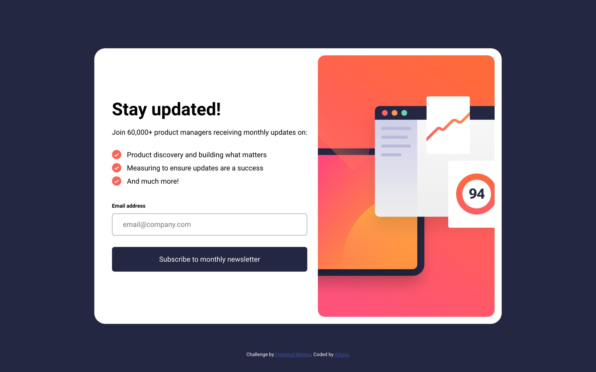
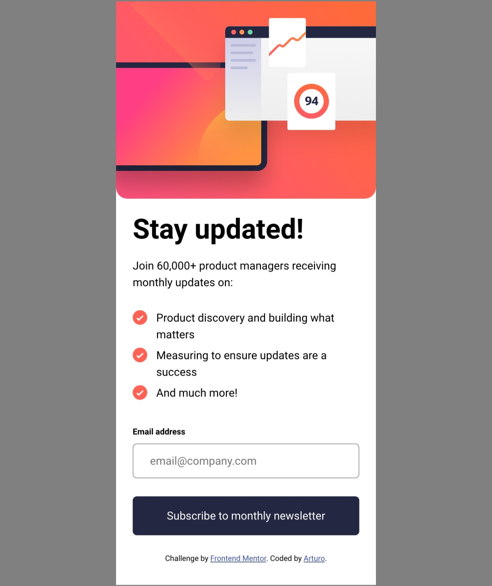

# Frontend Mentor - Newsletter sign-up form with success message solution

This is a solution to the [Newsletter sign-up form with success message challenge on Frontend Mentor](https://www.frontendmentor.io/challenges/newsletter-signup-form-with-success-message-3FC1AZbNrv). Frontend Mentor challenges help you improve your coding skills by building realistic projects. 

## Table of contents

- [Overview](#overview)
  - [The challenge](#the-challenge)
  - [Screenshot](#screenshot)
  - [Links](#links)
- [My process](#my-process)
  - [Built with](#built-with)
  - [What I learned](#what-i-learned)
  - [Continued development](#continued-development)

**Note: Delete this note and update the table of contents based on what sections you keep.**

## Overview

### The challenge

Users should be able to:

- Add their email and submit the form
- See a success message with their email after successfully submitting the form
- See form validation messages if:
  - The field is left empty
  - The email address is not formatted correctly
- View the optimal layout for the interface depending on their device's screen size
- See hover and focus states for all interactive elements on the page

### Screenshot




### Links

- Solution URL: [Github](https://github.com/arfernn/signup-challenge)
- Live Site URL: [Github pages](https://arfernn.github.io/signup-challenge/)

## My process

### Built with

- Semantic HTML5 markup
- CSS custom properties
- Flexbox
- Mobile-first workflow
- Vanilla Javascript

### What I learned

This was a challenging one. First thing I had to deal with was the formatting of the custom list items. Took me a while to figure out how to properly set paddings without having unindented new lines. 

Also, to add the custom image to the list items, I first tried the list-style-image property. However this brings some headaches when you want to add padding to the image. I found out that it's a common practice to set the image actually as a background-image of the li, like this;

```css 
li {
  background: url(assets/images/icon-list.svg) no-repeat 0px 4px;
  padding: 3px 10px 3px 2.125rem;
  list-style: none;
}
```

Also, it was my first time dealing with forms. And I didn't want to just send anything to a backend. I did this SPA style. Avoiding refreshes and just playing with view visibility. I also found here some funny behaviors, like when you press a button which is inside a form, it triggers a page refresh. And this was breaking my style changes. Adding an e.preventDefault() solved the problem.

Then, I played with transitions for the buttons. And I discovered that they don't work when you want to transition between linear-gradients. They only do with plain background-color. The workaround here is to use pseudo-elements and basically have two buttons one on top of the other. Then you transition the opacity:

```css 

button {
  padding: 1rem 1.5rem 1rem 1.5rem;
  margin-top: 1.625rem;
  color: white;
  background-image: linear-gradient(
    var(--clr-dark-slate-grey),
    var(--clr-dark-slate-grey)
  );
  font-weight: 700;
  border-radius: 6px;
  border: none;
  cursor: pointer;
  z-index: 1;
  position: relative;
  transition: 0.3s;
}

button::before {
  content: "";
  position: absolute;
  background-image: linear-gradient(
    336deg,
    var(--clr-coral),
    var(--clr-tomato)
  );
  opacity: 0;
  top: 0;
  right: 0;
  bottom: 0;
  left: 0;
  transition: opacity 0.3s linear;
  z-index: -1;
  border-radius: 6px;
}

button:hover::before {
  opacity: 1;
}

button:hover {
  box-shadow: 0px 20px 20px 1px rgb(255, 97, 85, 0.2);
}

```

### Continued development

I need to learn whats the most up to date way to handle form data when you want to send it to an actual backend, using ES6+.

